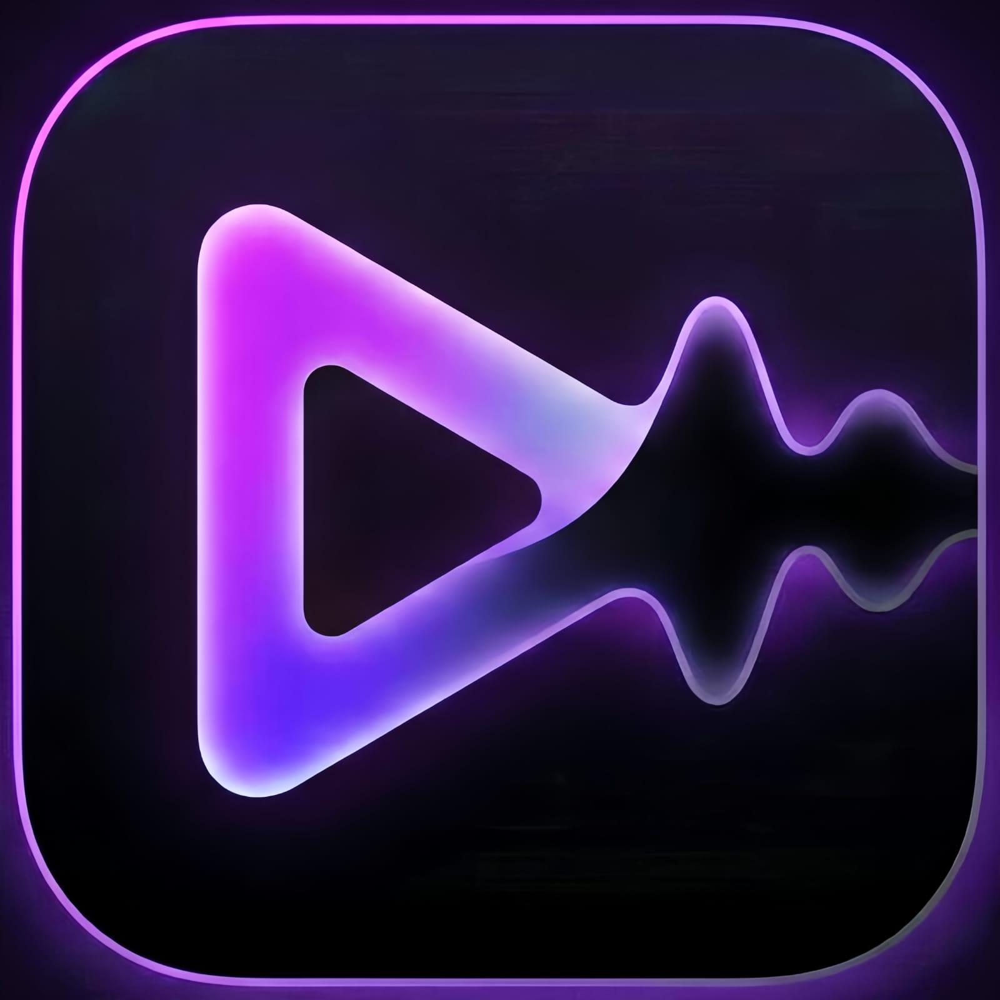

<p align="center">
  
</p>

<h1 align="center">🎵 BeatNova</h1>

<p align="center">
  <strong>Akıllı Müzik Çalar & Yapay Zeka Destekli Müzik Asistanı</strong>
</p>

<p align="center">
  
  
  
  
  
</p>

---

## 📖 Proje Hakkında

**BeatNova**, cihazınızdaki müzik dosyalarını otomatik olarak tarayan, güçlü bir arka plan oynatıcısıyla dinlemenizi sağlayan ve yapay zeka destekli müzik asistanıyla yeni şarkılar keşfetmenize yardımcı olan modern bir Android müzik çalar uygulamasıdır.

YouTube'dan indirilen şarkıların kapak resimlerini dosya adındaki video kimliğinden otomatik olarak çeker, internet bağlantısı olmadığında bile kesintisiz müzik deneyimi sunar ve şık, özelleştirilebilir temasıyla göz zevkinize hitap eder.

---

## ✨ Öne Çıkan Özellikler

### 🎶 Müzik Çalar
- 📂 Cihazınızdaki tüm müzik dosyalarını otomatik tarama (`expo-media-library`)
- ▶️ Arka planda kesintisiz müzik çalma (`react-native-track-player v5`)
- 🔀 Karıştırma, tekrarlama ve sıra yönetimi
- 🎨 Otomatik kapak resmi çekme (YouTube thumbnail & iTunes/Deezer API)
- 📊 İlerleme çubuğu ile şarkı kontrolü

### 🤖 Yapay Zeka Müzik Asistanı
- 💬 Google Gemini AI ile kişiselleştirilmiş müzik önerileri
- 🔍 Web araması entegrasyonu ile güncel müzik trendleri (Tavily API)
- ⚡ Hızlı erişim butonları — "Enerjik playlist", "Odaklanma müziği", "Popüler trendler"
- 📋 Detaylı playlist bilgileri (enerji seviyesi, ruh hali, süre, tür)

### 🎨 Temalar & Kişiselleştirme
- 🌙 Karanlık / Aydınlık mod desteği
- 🎭 Birden fazla renk paleti (Neon, Pastel, Gün Batımı ve daha fazlası)
- 📐 Özelleştirilebilir yazı tipi boyutu

### 📊 İstatistikler & Takip
- ⏱️ Toplam dinleme süresi
- 🏆 En çok dinlenen şarkılar
- 📈 Dinleme alışkanlıkları grafiği

### ❤️ Favoriler & Playlistler
- 💾 Favori şarkılarınızı kaydedin
- 📋 Kendi playlistlerinizi oluşturun
- 📱 Veriler cihazda güvenle saklanır

### 🌐 Çevrimdışı Destek
- 📡 İnternet bağlantısı kontrolü (`NetInfo`)
- ✈️ Çevrimdışıyken müzik dinlemeye devam edin
- ⚠️ Uyarılı mod — Kullanıcıyı bilgilendirerek sorunsuz deneyim

---

## 🏗️ Teknoloji Yığını

| Katman | Teknoloji |
|---|---|
| **Framework** | [Expo](https://expo.dev) (SDK 54) + React Native 0.81 |
| **Dil** | TypeScript |
| **Navigasyon** | Expo Router v6 (Drawer + Tabs + Stack) |
| **Stil** | NativeWind v4 (TailwindCSS) |
| **Müzik Çalar** | React Native Track Player v5 (`@rntp/player`) |
| **Yapay Zeka** | Google Gemini 2.5 Flash (AI SDK) |
| **Web Araması** | Tavily API |
| **Medya Erişimi** | Expo Media Library |
| **Durum Yönetimi** | React Context + TanStack Query |
| **Ağ Kontrolü** | @react-native-community/netinfo |
| **Reklamlar** | Google Mobile Ads (AdMob) |
| **Animasyonlar** | React Native Reanimated |
| **Build & Deploy** | EAS Build + EAS Submit |

---

## 📁 Proje Yapısı

```
BeatNova/
├── app/                          # Expo Router sayfaları
│   ├── (auth)/                   # Giriş / Kayıt ekranları
│   ├── (drawer)/                 # Drawer menüsü
│   │   ├── (tabs)/               # Alt sekme navigasyonu
│   │   │   ├── index.tsx         # 🏠 Ana Sayfa
│   │   │   ├── songs.tsx         # 🎵 Şarkı Listesi
│   │   │   ├── MusicAssistant.tsx # 🤖 AI Müzik Asistanı
│   │   │   ├── PlayList.tsx      # 📋 Playlistler
│   │   │   └── settings.tsx      # ⚙️ Ayarlar
│   │   ├── Favorite.tsx          # ❤️ Favoriler
│   │   ├── Statistic.tsx         # 📊 İstatistikler
│   │   └── Theme.tsx             # 🎨 Tema Seçimi
│   └── api/
│       └── object+api.ts         # 🧠 AI Backend (Gemini API)
├── components/
│   ├── AudioPlayer.tsx           # 🎧 Mini Oynatıcı Bileşeni
│   ├── ProgressSection.tsx       # 📊 İlerleme Çubuğu
│   └── songs/
│       └── songsService.tsx      # 🔧 Şarkı Yükleme & Kapak Resmi Servisi
├── hooks/
│   └── useAudioPlayer.ts         # 🎵 Müzik Çalar Hook'u
├── providers/
│   └── player-context.tsx        # 🔄 Global Çalar Durumu
├── services/
│   ├── playbackService.ts        # ▶️ Arka Plan Oynatma Servisi
│   ├── PlaylistServices.ts       # 📋 Playlist Yönetimi
│   └── StatisticServices.ts      # 📈 İstatistik Servisi
├── lib/
│   └── tools/
│       └── webSearch.ts          # 🔍 Tavily Web Araması
├── theme/                        # 🎨 Tema & Renk Paletleri
├── schemes/                      # 📐 Zod Şemaları
└── assets/                       # 🖼️ Görseller & Fontlar
```

---

## 🚀 Kurulum

### Ön Gereksinimler

- [Node.js](https://nodejs.org/) (v18+)
- [Expo CLI](https://docs.expo.dev/get-started/installation/)
- Android Studio (fiziksel cihaz veya emülatör için)
- Google Gemini API Anahtarı ([AI Studio](https://aistudio.google.com/app/apikey))

### Adımlar

```bash
# 1. Projeyi klonla
git clone https://github.com/Gargamel988/BeatNova.git
cd BeatNova

# 2. Bağımlılıkları yükle
npm install

# 3. Ortam değişkenlerini ayarla
cp .env.local.example .env.local
# .env.local dosyasını düzenleyerek API anahtarlarını gir

# 4. Android build al ve çalıştır
npx expo run:android
```

### Ortam Değişkenleri

`.env.local` dosyasında aşağıdaki değişkenleri tanımlayın:

```env
# Yapay Zeka (Zorunlu — Asistan için)
GOOGLE_GENERATIVE_AI_API_KEY=your_gemini_api_key

# Web Araması (Opsiyonel — Güncel trend bilgileri için)
TAVILY_API_KEY=your_tavily_api_key

# Google Reklamlar (Opsiyonel — AdMob)
EXPO_PUBLIC_AD_UNIT_ID_BANNER_HOME=your_ad_unit_id
EXPO_PUBLIC_AD_UNIT_ID_BANNER_ASSISTANT=your_ad_unit_id
# ... diğer reklam birimleri
```

---

## 📱 Ekran Görüntüleri

> *Yakında eklenecek*

---

## 🔧 Geliştirme Komutları

```bash
# Geliştirme sunucusu
npx expo start --clear

# Android'de çalıştır
npx expo run:android

# TypeScript denetimi
npx tsc --noEmit

# Lint kontrolü
npx expo lint

# Üretim build'i (EAS)
eas build --platform android --profile production

# Google Play Store'a gönder
eas submit --platform android --profile production --latest
```

---

## 🎯 Yol Haritası

- [x] Cihazdan müzik okuma ve çalma
- [x] Arka plan oynatma desteği
- [x] YouTube thumbnail ile otomatik kapak resmi
- [x] AI müzik asistanı (Gemini)
- [x] Tema ve kişiselleştirme
- [x] Favoriler ve playlistler
- [x] İstatistik sayfası
- [x] Çevrimdışı mod desteği
- [ ] iOS desteği
- [ ] Ekolayzer (Equalizer)
- [ ] Şarkı sözleri gösterimi
- [ ] Sosyal paylaşım özellikleri
- [ ] Widget desteği

---

## 🤝 Katkıda Bulunma

Katkılarınızı memnuniyetle karşılıyoruz!

1. Projeyi fork edin
2. Yeni bir branch oluşturun (`git checkout -b feature/yeni-ozellik`)
3. Değişikliklerinizi commit edin (`git commit -m 'feat: yeni özellik eklendi'`)
4. Branch'i push edin (`git push origin feature/yeni-ozellik`)
5. Bir Pull Request açın

---

## 📄 Lisans

Bu proje [MIT Lisansı](LICENSE) ile lisanslanmıştır.

---

## 👨‍💻 Geliştirici

**Gargamel** — [@Gargamel988](https://github.com/Gargamel988)

---

<p align="center">
  BeatNova ile müziğin tadını çıkarın 🎧✨
</p>
